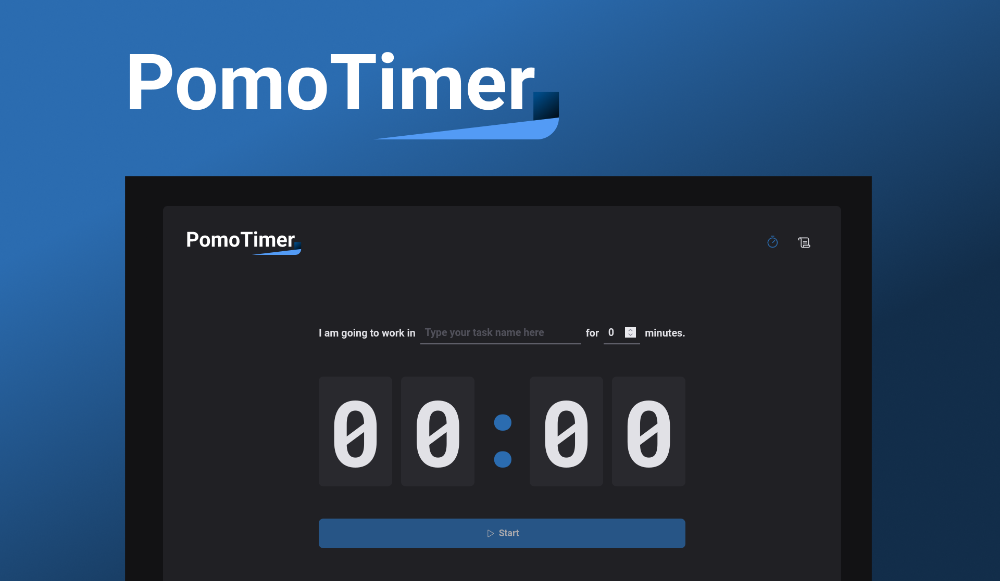

 <br />
  <br />
<p align="center">
  Welcome to PomoTimer, your go-to app for boosting productivity and managing your time effectively! Whether you're studying, working, or just need to stay focused, PomoTimer's customizable Pomodoro timer and task tracking features are here to help. Say goodbye to procrastination and hello to a more productive you with PomoTimer!
</p>

<h3>📚 Technologies</h3>

  - React
  - npm
  - Typescript
  - styled-components (Styles library)
  - React Hook Form
  - date-fns (Date handler)
  - Immer
  - React Router Dom
  - Zod (Form Validator)
  - Phosphor Icons (Icons library)


  1. Clone the repository:
  Open your terminal (Command Prompt for Windows) and execute the following command to clone the Pomotimer repository:
  ```bash
  git clone git@github.com:CesarCanoff/pomotimer.git
  ```

  2. Navigate to the app directory:
  Change to the Pomotimer directory that you just cloned:
  ```bash
  git clone git@github.com:CesarCanoff/pomotimer.git
  ```

  3. Install dependencies:
  Use npm to install all the app's dependencies. This may take some time depending on the project's size:
  ```bash
  npm install
  ```
  4. Run web app:
  After the dependencies are successfully installed, you can start the app. Run the following command:
  ```bash
  npm run dev
  ```